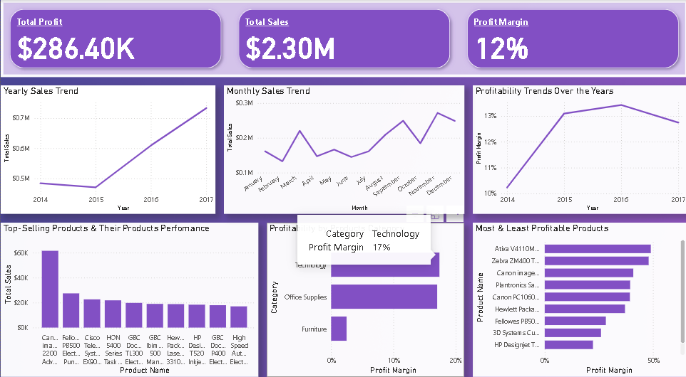

# Sales and Profitability Analysis (2014–2017)

This Power BI project provides a comprehensive analysis of total sales, profit, and profit margin from 2014 to 2017. It highlights key trends, identifies top-performing products, and gives strategic business insights.

## 📊 Dashboard Overview

- **Total Sales** grew from $470K in 2015 to $733K in 2017.
- **Profit Margin** increased from 10% in 2014 to over 13% in 2016.
- **November** was consistently the top month for sales.
- **Canon ImageCLASS 2200 Copier** was the best-selling product.

## 🔍 Key Business Insights

- Focus on high-margin products in the **Technology** category.
- Review low-margin but high-selling products to improve profit.
- Leverage seasonal trends like **November** to drive promotions.

## 📁 Files

- `Sales_Profitability.pbix`: Power BI file containing the full dashboard.
- `Dashboard_Screenshot.png`: A snapshot of the dashboard for quick viewing.
- `data/`: Contains the sales dataset used in the analysis.

## 📌 Tools Used

- Power BI
- Excel (for initial data cleaning)

---

Feel free to explore the dashboard and suggest improvements!
